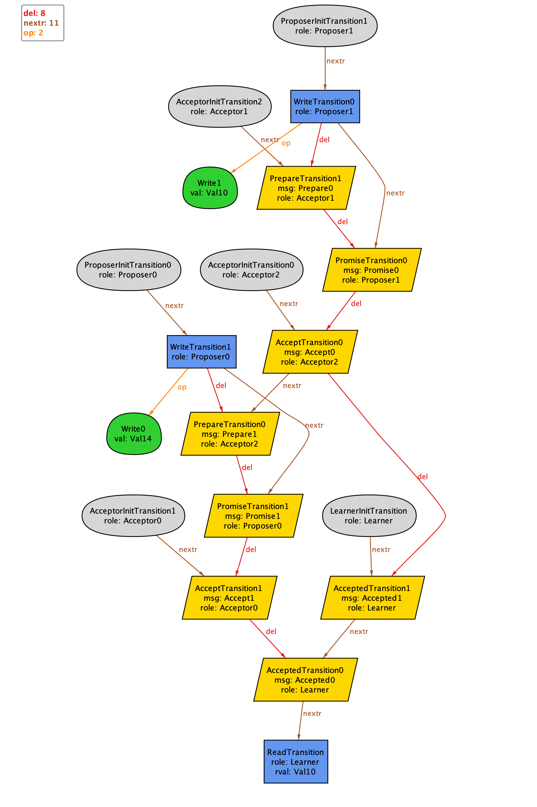

# Paxos modeled using Principles of Eventual Consistency in Alloy



This repo models the Paxos algorithm using Sebastian Burckhardt's approach for modeling eventually consistent data types.
This approach is documented in his excellent (and free!) book [Principles of Eventual Consistency][PoEC], which I'll refer to here as PoEC.

The model implemented here is based on the description of the algorithm in Lamport's [Paxos Made Simple][PMS] paper.

I've implemented the model in [Alloy], which is a great fit for the [PoEC] approach since they are both graph-based.


## Specifying behavior as a replicated data type

Burckhardt's approach to modeling requires that we describe the algorithm as what he calls a *replicated data type*, in Chapter 4 of [PoEC].
That means we need to specify how this register should behave given its operation context (which operations are visible, and in what order).
The operation context is a set of operations, their visiblity, and arbitration ordering.

I'm going to model Paxos algorithm as a kind of register.
Specifically, I'm going to model it as a "write-first-wins" register.
This means that, if there are multiple writes, only the first write actually takes effect.
"First" is defined by the arbitration relation

This means that multiple writes are technically allowed to the register, but every read will return the same value, which is one associated with the first write.

More formally:

Given C=(E, op, vis, ar)

F(read, C) evaluates to the falue written by the first write in E according to the ordering `ar`.

## Protocol pseudocode

We're going to implement the Paxos protocol in Burckhardt's pseudocode, using the description in [Paxos Made Simple][PMS].

To keep things simple, I'm going to assume there's a single Learner, that reliably receives "accepted" messages from all of the acceptors.

All other message can potentially be lost.

```
// default of Val is undef


protocol Paxos<Val> {
  const MAJORITY : nat; // number of responses that constitutes a majority

  // From Paxos Made Live, Section 2.1
  //   Messages can take arbitrarily long to be delivered, can be duplicated,
  //   and can be lost, but they are not corrupted.
	//
	// This corresponds to the dontforge transport guarantee
  // See Section 8.2 (Transport Guarantees) in PoEC

	struct Proposal(n: nat, v: Val)

	// Lamport calls this: "a prepare request with number n"
	// We also send the pid of the proposer so that the acceptor knows where to send the response to
	message Prepare(pid: nat, n: nat): dontforge


  // a promise not to accept any more proposals numbered less than n and with
	// the highest-numbered proposal (if any) that it has accepted.
	message Promise(aid: nat, pid: nat, p: Proposal): dontforge

	message Accept(ids: set<nat>, p: Proposal) : dontforge

	message Accepted(aid: nat, p: Proposal): reliable

  // From Paxos Made Simple:
  //    Different proposers choose their numbers from disjoint sets of numbers,
	//    so two different proposers never issue a proposal with the same number.
	//
	// We model this by passing in the proposal number, n, which is guaranteed unique.
	// We also pass in a unique id, pid.
	role Proposer(pid: nat, n: nat) {

		var value: Val;
		var responses: set<nat>; // set of ids of acceptors that responded

		operation write(val: Val) {
			// This starts Phase 1
			send Prepare(pid, n);
			value := val;

		}

	  // Response to prepare message
		receive Promise(aid: nat, ppid: nat, p: Proposal) {
			if(pid = ppid) {
				responses := responses + {aid} ;
				// If the acceptor already accepted a value, we have to use that one
				if(p.n > 0) {
					value := p.v;
				}

				// If a majority of acceptors have promised, send an accept message
				if(|responses| >= MAJORITY) {

					// This sends an accept to all of the acceptors that responded with the promise
					send Accept(responses, Proposal(n, value));

					// There's a risk of multiple returns from the same response, so
					// really we should check first to make sure we haven't returned yet,
					// but I'm just going to skip it for now
					return ok;
				}
			}
		}
	}

	role Acceptor(aid: nat) {
		// p5
		// an acceptor needs to remember only the highest numbered proposal that it has ever accepted
		// and the number of the highest numbered prepare request to which it has responded.
		var accepted: Proposal; // highest numbered proposal accepted
		var promised : nat; // highest numbered prepared request

    // p5
		receive Prepare(n) {
			// Phase 1b
			// P1a: An acceptor can accept a proposal numbered n iff it has not responded
			// to a prepare request having a number greater than n.
			if(n > promised) {
				promised := n;
				send Promise(aid, pid, accepted);
			}
		}

		receive Accept(ids, n, v) {
			if(aid in ids) {
				if(n >= promised) {
					accepted := Proposal(n,v);
					send Accepted(aid, accepted);
				}
			}
		}
	}


	role Learner {
		var votes: pmap<nat, Val> // aid -> value

		message Accepted(aid: nat, p: Proposal) {
			votes[aid] := p.v
		}

    // Return the value that has the majority of votes,
		// or undef if nobody has a majority
		operation read() {
			var tally: pmap<Val, nat>
			// tally up the votes
			foreach((aid, v) in votes) {
				tally[v] := tally[v] + 1
				if(tally[v]>= MAJORITY) {
					return v;
				}
			}
			return undef;
		}
	}
}
```

## Translating to Alloy

See Section 8.4 Pseudocode Compilation (p101) of [PoEC] for how to translate pseudocode to the model.

You can find my model at [impl.als](impl.als).


[PoEC]: https://www.microsoft.com/en-us/research/publication/principles-of-eventual-consistency/
[PMC]: https://lamport.azurewebsites.net/pubs/paxos-simple.pdf
[Alloy]: https://alloy.readthedocs.io/